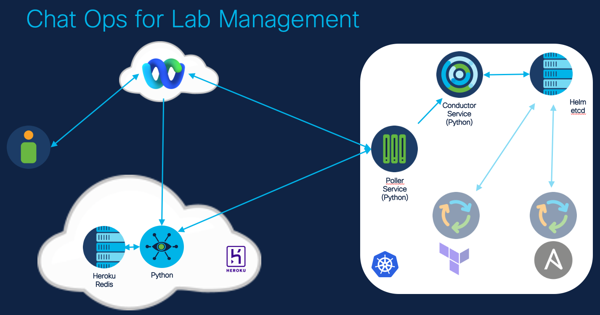

# Maestro Application

Repository for bringing all the services together

## Application Architecture

- Cloud Front End
    - [Webex Bot](https://github.com/broadcaststorm/maestro-webex-service)
- On-prem orchestration
    - [Conductor Service](https://github.com/broadcaststorm/maestro-conductor-service): Central point for coordinating configuration and operations of the lab orchestration.
    - [Poller Service](https://github.com/broadcaststorm/maestro-poller-service): Coordinates with bot front end to process commands and relay them to the conductor.
- Backend Storage
    - [etcd](https://etcd.io), [etcd docs](https://etcd.io/docs/v3.5/)
- Terraform Service (roadmap)
- Ansible Service (roadmap)

## Deployment Technologies

- Kubernetes
    - Development environment: [Rancher Desktop: containerd based](https://rancherdesktop.io)
    - Production environment: [Intersight Kubernetes Service](https://intersight.com/help/saas/resources/intersight_kubernetes_service_user_guide)
- [Helm](https://helm.sh)

Technologies employed in each services are explained in their respective repositories.

## References Leveraged During Development

- Visual Studio Code
    - [Python in a Container](https://code.visualstudio.com/docs/containers/quickstart-python)
- Rancher Desktop
    - [Mac Global Unicast IP issue](https://github.com/rancher-sandbox/rancher-desktop/issues/1141)
- Git
    - [Github CLI](https://cli.github.com)
    - [pre-commit framework](https://pre-commit.com)
- [ArtifactHub](https://artifacthub.io/) for Helm Charts
- [Operator Framework](https://operatorframework.io)
- etcd
    - [etcd Operator (archived)](https://operatorhub.io/operator/etcd)
    - [6 tips for etcd](https://blog.px.dev/etcd-6-tips/)
- Helm Chart Docs
    - [Charts](https://helm.sh/docs/topics/charts/)
    - [Template Guide](https://helm.sh/docs/chart_template_guide/getting_started/)
    - [VS Code K8s Tool](https://marketplace.visualstudio.com/items?itemName=ms-kubernetes-tools.vscode-kubernetes-tools)
- [Helm Chart Example for etcd](https://github.com/mkhpalm/helm-charts)
- Bitnami Helm Chart
    - [Artifact Hub Entry](https://artifacthub.io/packages/helm/bitnami/etcd)
    - [Bitnami Docs](https://docs.bitnami.com/kubernetes/infrastructure/etcd/)
    - [Bitnami Chart GitHub](https://github.com/bitnami/charts/tree/master/bitnami/etcd)
    - [Bitnami Docker Hub](https://hub.docker.com/r/bitnami/etcd/tags)
- [Quay.io container](https://quay.io/repository/coreos/etcd)
- **getent hosts __name__** for DNS lookups without bind-utils
- Visibility
    - [Pixie](https://px.dev)
- Webex
    - [Bots and Messaging](https://developer.webex.com/docs/api/guides/bots)
    - [Buttons and Cards](https://developer.webex.com/docs/api/guides/cards)
    - [PyAdaptiveCards](https://github.com/CiscoSE/pyadaptivecards)

## Roadmap

- Automation Service: Configure, store, and apply specific automation actions to targeted project/scenario combinations
- Websocket based Bot: convert buffer/poller to websocket approach
- Proxy support
- Link related GitHub repositories together to this repo
- Pipeline
    - GitHub Actions
        - Autobuild containers in all repositories
        - Decide on mechanism for versioning and autopublish those containers
    - Push new versions of containers
